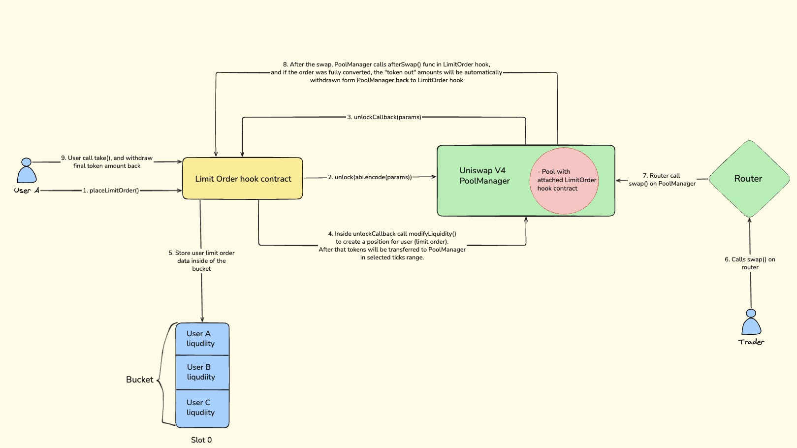

## Limit Order Hook

A Uniswap V4 Hook that implements **on-chain limit orders** by representing each order as concentrated liquidity in a single tick band \([`tickLower`, `tickLower + tickSpacing`)\) and finalizing filled bands in `afterSwap`.

### Navigation

- [Project intro](#project-intro)
- [Limit orders, and why Uniswap V4 enables them](#limit-orders-and-why-uniswap-V4-enables-them)
- [Project structure and architecture](#project-structure-and-architecture)
- [Hook permissions used (and why)](#hook-permissions-used-and-why)
- [Setup instructions](#setup-instructions)

## Quick project intro

This repository contains a minimal limit order system implemented as a Uniswap V4 hook.

- **How an order is represented**: a user places a limit order by depositing liquidity into a single Uniswap V4 LP range \([`tickLower`, `tickLower + tickSpacing`)\).
- **How an order is filled**: when swaps move the pool price across the relevant tick bands, the hook detects bands that became fully converted and withdraws that liquidity from the pool into the hook contract.
- **How a user claims**: once a bucket is marked filled and token amounts are recorded, users call `take()` to withdraw their pro-rata share.

## Limit orders, and why Uniswap V4 enables them

### Usual limit orders

In traditional order books, a limit order is: “buy/sell at a specific price (or better)”. The engine keeps your order in a queue and matches it when the market reaches your price.
That's how order book is working at Binance exchange for example.

### Why Uniswap V3 typically needed off-chain automation

Uniswap V3 is working on the same AMM mechanism as V4, but it doesn’t have protocol-native **order execution callbacks** - hooks.
You can approximate a limit order by providing one-sided concentrated liquidity outside the current price, but there is no built-in mechanism that:

- detects crosses at the exact moments you care about
- automatically finalizes your position and records amounts

In practice, V3 limit orders usually required **off-chain keepers/bots** to watch price movement and execute management transactions (withdraw, rebalance, or close positions) at the right time.

### What Uniswap V4 changes

Uniswap v4 introduces **Hooks**: programmable contracts that can run logic at specific points in the pool lifecycle (e.g. `afterInitialize`, `afterSwap`).

That means you can implement a fully on-chain limit order finalization flow:

- the pool calls your hook during swaps
- the hook determines which tick bands were crossed
- and the hook can withdraw/finalize liquidity for eligible “limit order buckets” within the same transaction context

## Project structure and architecture

### Limit Order Simplified Workflow Diagram


### `LimitOrder.sol`

The main hook contract.

- **Order representation**: orders are keyed by `(poolId, tickLower, zeroForOne)` and stored in “buckets.”
- **Buckets and generations**:
  - `slots[bucketId]` points to the current bucket “generation” at that key.
  - `buckets[bucketId][slot]` stores aggregated liquidity and per-user accounting for that generation.
- **Swap processing**: `_afterSwap` computes which grid-aligned tick bands to scan and finalizes filled buckets.
- **Callbacks**: `unlockCallback` is used with `poolManager.unlock()` to safely place/cancel liquidity using flash accounting.

### `ILimitOrder.sol`

Public interface and the `Bucket` struct definition.

The `Bucket` tracks:

- whether the bucket has been filled (`filled`)
- total bucket liquidity and per-user liquidity
- fee accounting snapshots (`feePerLiquidity0/1`, `userFee0/1`, `userOwed0/1`)
- recorded amounts (`amount0`, `amount1`) for users to claim via `take()`.

### `Events.sol`

Library defines events for `LimitOrder.sol` hook contract.

### `Errors.sol`

Library defines errors for `LimitOrder.sol` hook contract.

### `ActionLib.sol`

Stores an “action” flag in transient storage (EIP-1153) so `unlockCallback` can dispatch between “place” vs “cancel” logic, and also acts as a lightweight reentrancy guard for the callback flow.

### `SafeCast.sol`

Small helpers for safe casts used when translating deltas/liquidity between signed/unsigned types.

## Hook permissions used

This hook enables only:

- **`afterInitialize`**: to snapshot the initial pool tick into `ticks[poolId]`.
- **`afterSwap`**: to detect tick movement since the previous snapshot and finalize eligible limit-order buckets by withdrawing liquidity and recording amounts.

## Setup instructions

### Prerequisites

- [Foundry](https://book.getfoundry.sh/) installed (`forge`, `cast`).

### Build

```bash
forge build
```

### Tests

```bash
forge test
```

### Notes

- This repo uses `via_ir = true` in `foundry.toml` to avoid “stack too deep” issues when compiling with Solidity 0.8.30.
- The contract **isn't audited** and it **isn't ready for the production use**. Keep this in mind please.